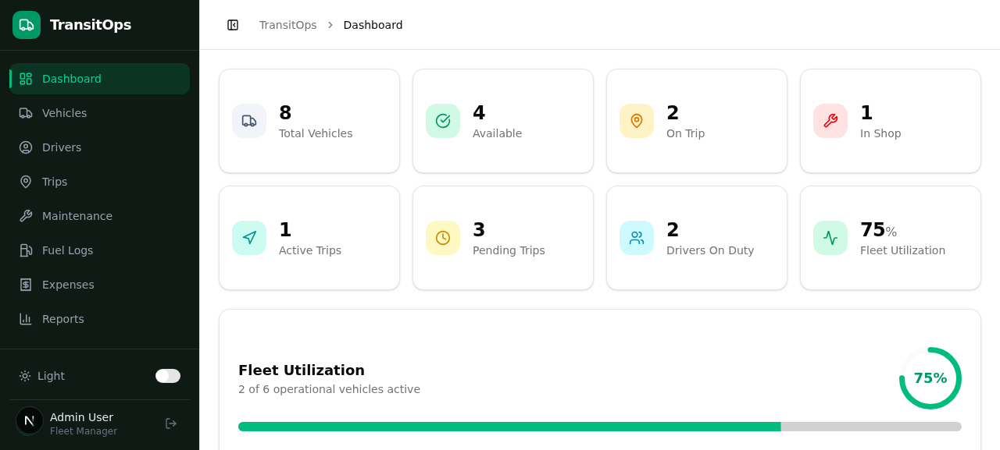
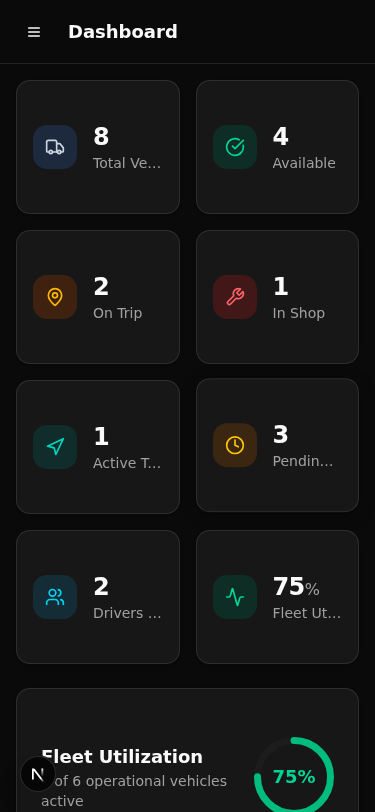
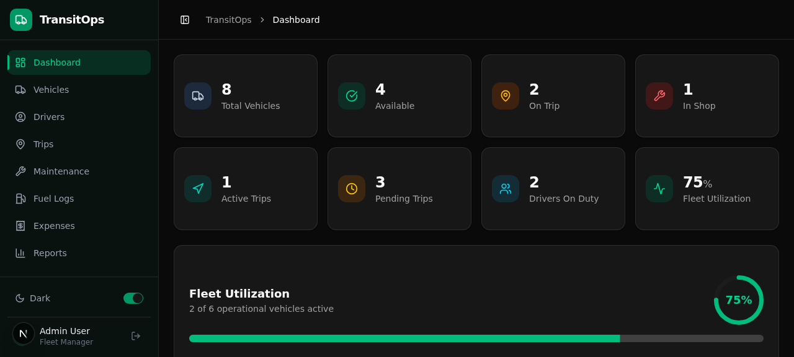
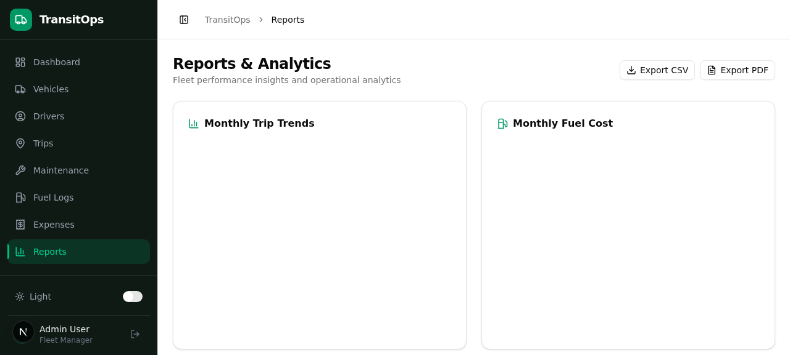
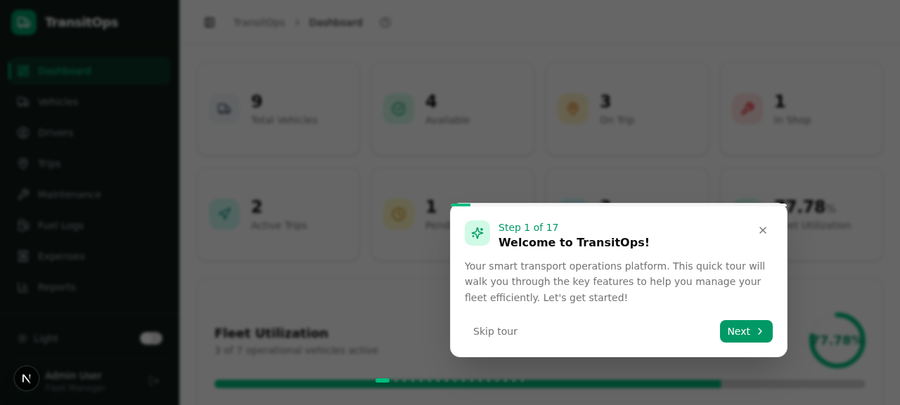
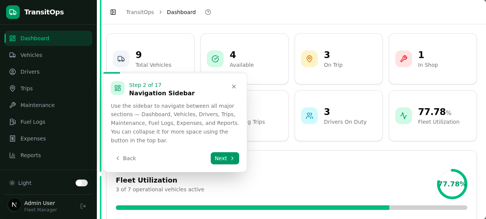
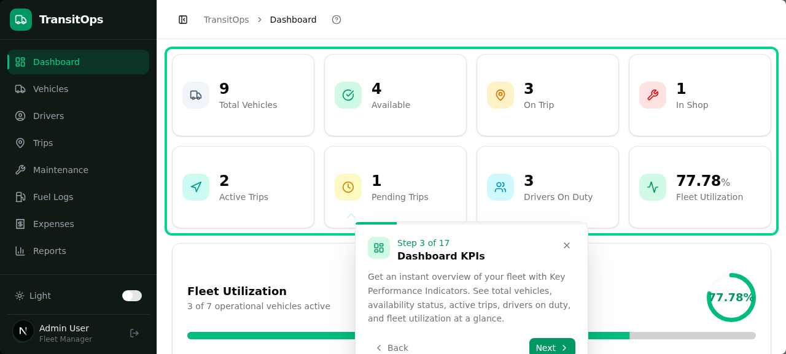
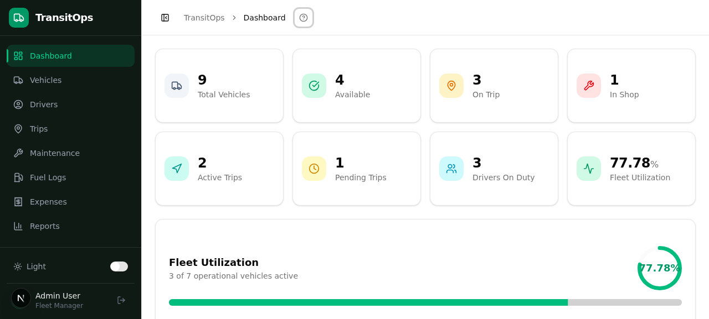

# TransitOps

**TransitOps** is a smart transport operations platform built with Next.js, Tailwind CSS, Prisma, and a modular UI component system. It provides fleet managers with an integrated dashboard to manage vehicles, drivers, trips, maintenance, fuel logs, expenses, and operational reports.

## Features

- Role-based login and registration
- Interactive fleet dashboard with KPIs and charts
- Vehicle, driver, trip, maintenance, fuel, and expense management
- Real-time operational reports and analytics
- Guided tour for new users
- SQLite + Prisma backend with standalone Next.js deployment support

## Screenshots

### Dashboard



### Mobile view



### Dark mode and system theme support



### Reports page



### Product tour flow






### Final app view


## Tech Stack

- Next.js 16
- React 19
- TypeScript
- Tailwind CSS 4
- Prisma ORM
- SQLite (via `DATABASE_URL`)
- Next Auth-style JWT auth with `jsonwebtoken`
- Radix UI + shadcn-inspired reusable UI components

## Getting Started

### Prerequisites

- Node.js 20+ or Bun
- Git

### Setup

1. Clone the repo

```bash
git clone https://github.com/bhadrechadharmesh/TransitOps.git
cd transitops
```

2. Install dependencies

```bash
npm install
```

3. Add environment variables

Create a `.env` file at the project root with at least:

```env
DATABASE_URL="file:./dev.db"
JWT_SECRET="your-secret-key"
```

> If `DATABASE_URL` is not set, Prisma will require it before running migrations.

4. Initialize the database

```bash
npm run db:push
npm run db:generate
```

### Development

```bash
npm run dev
```

Then open `http://localhost:3000`.

### Build and Production

```bash
npm run build
npm start
```

## Database Schema

The app uses Prisma models for:

- `User` — role-based users: Fleet Manager, Driver, Safety Officer, Financial Analyst
- `Vehicle` — fleet asset tracking and status
- `Driver` — license, status, and assignment
- `Trip` — route planning, dispatch, and completion
- `Maintenance` — service events and costs
- `FuelLog` — fueling history
- `Expense` — vehicle-based expense tracking

## Application Pages

- Dashboard
- Vehicles
- Drivers
- Trips
- Maintenance
- Fuel Logs
- Expenses
- Reports

## Notes

- The app stores auth state in local storage and uses a client-side app shell for navigation.
- Production mode is configured to output a standalone Next.js server (`next.config.ts`).
- The UI includes guided tour support for onboarding.

## Contact

If you want to extend the app, add custom driver workflows, or integrate remote APIs, this codebase is a good starting point for fleet operations and transport logistics management.
